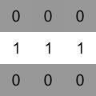

# Maze Tiles

[](https://travis-ci.org/marcbreitung/maze-tiles) [](https://coveralls.io/github/marcbreitung/maze-tiles?branch=master)

Build a graph based on tiles. A tile is represented by 1 for walkable parts and 0 for not walkable parts.

 
 




## Tile

A single tile.

```javascript
var tileOptions = {'row': 1, 'column': 1, 'walkable': [0, 1, 0, 1, 1, 1, 0, 1, 0]};
var tile = new MazeTiles.Tile(tileOptions);
```

## Tiles

Tiles list. Calculates a graph based on the walkable parts defined in a tile.

```javascript
var tilesOptions = {'width': 3, 'height': 3};
var tiles = new MazeTiles.Tiles(tilesOptions);
tiles.add(new MazeTiles.Tile(tileOptions));
```

## Bit Field
```javascript
var bitFieldA = MazeTiles.BitField.getBitField(0, 1, 0, 0, 1, 1, 0, 0, 0);
var bitFieldB = MazeTiles.BitField.getBitField(0, 0, 0, 1, 1, 1, 0, 0, 0);
```